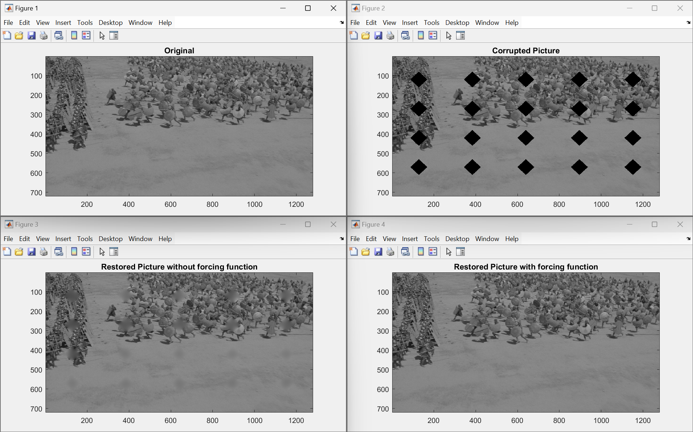
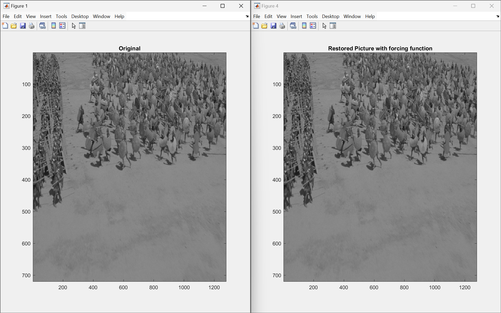

---
runme:
  id: 01HTZMHTDDTNN2CCE2V55AAJM7
  version: v3
---

# Corrupted-Image-Repair-Algorithm-via-PDE-Based-SOR-Scheme-for-Image-Inpainting

Algorithm for Corrupted Image Repair via Partial Differential Equation (PDE)-Based Successive Overrelaxation (SOR) Scheme for Image Inpainting

# 2D FDM Image Restoration Algorithm

This MATLAB code implements a 2D Finite Difference Method (FDM) for image restoration, specifically designed for the corrupted image "greece.tif". The algorithm aims to fill in the holes present in the corrupted image using the 2D FDM equation. The forcing function necessary for the restoration process is provided in the file "forcing.mat".

## Prerequisites
- MATLAB environment
- Image Processing Toolbox

## Usage
1. Make sure all the required files ("greece.tif", "forcing.mat", "badpicture.mat", and "badpixels.tif") are present in the MATLAB working directory.
2. Run the MATLAB script.

## Description
1. **File Inputs**:
   - `greece.tif`: Original uncorrupted picture.
   - `badpicture.mat`: Corrupted image data.
   - `badpixels.tif`: Indicator picture showing corrupted pixel sites.
   - `forcing.mat`: Magic forcing function used for restoration.

2. **Restoration Process**:
   - The algorithm initializes by loading necessary data and setting parameters.
   - It iterates over the missing pixels, updating the restored image using the 2D FDM equation.
   - Two restoration processes are conducted: one without a forcing function and one with a forcing function.
   - Error vectors are calculated for both processes.
   - Restored images are displayed along with plots showing error versus iteration.

3. **Parameters**:
   - `total_iterations`: Total number of iterations for restoration.
   - `a`: Relaxation parameter for the update equation.
   - `E`: Error vector for each pixel.
   - `err1`, `err2`: Error vectors for restoration without and with a forcing function, respectively.

## Outputs
1. **Figure 1**: Original uncorrupted image.
2. **Figure 2**: Corrupted image.
3. **Figure 3**: Restored image without forcing function.
4. **Figure 4**: Restored image with forcing function.
5. **Figure 5**: Plot of error vectors versus iteration.

### All 4 Images Comparision

### Ideal Output and Algorithm Output Comparision

## Additional Notes
- This algorithm utilizes the 2D FDM equation for image restoration.
- It allows for comparison between restoration with and without a forcing function.
- Error vectors provide insights into the convergence of the restoration process.

For further details, refer to the comments within the MATLAB script.
